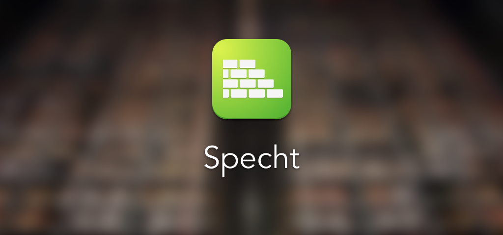

# Specht

   
### A rule-based proxy app built with Network Extension for macOS.

## Overview
Specht is a simple proxy app built with [NEKit](https://github.com/zhuhaow/NEKit).

**Unless you have a developer ID with Network Extension entitlement, you cannot use Specht ([Why?](https://github.com/zhuhaow/SpechtLite#full)).** Please use [SpechtLite](https://github.com/zhuhaow/SpechtLite) instead.

Specht can do everything SpechtLite can do.

Plus, Specht sets up proxy automatically through API provided by Network Extension so you do not need to do it in System Preferences yourself. And Specht can redirect all TCP flows (even when apps ignore system proxy settings) to go through proxy servers.

The core of Specht consists just a few lines of code invoking [NEKit](https://github.com/zhuhaow/NEKit). Specht is mainly provided as a demo for developers who want to work with NEKit. Use SpechtLite if you are not interested in Network Extension.

Note there is no fancy GUI configuration panel. You set up Specht with configuration files as [SpechtLite](https://github.com/zhuhaow/SpechtLite).

## Configuration File
Refer to [SpechtLite](https://github.com/zhuhaow/SpechtLite) for how to write configuration files.

## How to sign this app?
You have to sign this app yourself to run it which means you have to:

* Join Apple Developer Program ($99/year)
* [Request](https://developer.apple.com/contact/network-extension/) Network Entension entitlement from Apple (at least Packet Tunnel).

After you get the permission from Apple, go to [Certificates, Identifiers & Profiles](https://developer.apple.com/account/mac/certificate/):

1. Issue a Mac Development certificate (skip it if you already have one).
2. Register two App IDs for the app and its embedded extension, what Specht uses can be found in the XCode, you can change them if you want (I suggest not changing them until you get everything up and running.) Don't forget to select "Personal VPN".
3. Go to provision to add two new profiles, select "Mac App Development", and follow the guide, do include Network Extension entitlement. 

Now you can sign the app, in Build Settings, set Provisioning Profile to the correct provision files just created and build.

## Some tips
* Do get to know how Network Entension works from the offcial document before you change anything.
* Use "Console" and filter to see what is wrong with macOS.
* Kill "SpechtTunnelPacketProvider" (and if something is not working correctly, "neagent") before running each rebuild.
* The old "SpechtTunnelPacketProvider" usually will be uninstalled correctly but the new one may not get installed. You can check this in "Console". If anything goes wrong, you have to go to `xcodebuild -project Specht.xcodeproj -configuration Debug -showBuildSettings | grep TARGET_BUILD_DIR` and then into `Specht.app/Contents/PlugIns`, run `pluginkit -a SpechtTunnelPacketProvider.appex` to install the extension manually.

## Known Issues
* When we disconnect, "SpechtTunnelPacketProvider" should terminate immediately. However, it will stil run for several seconds. If we connect to a new tunnel immediately, it will use the old "SpechtTunnelPacketProvider" process which will be killed in a few seconds later. So I have to terminate the extension explicitly as of now. Though there should be no consequences, the system thinks the extension die unexpectedly, so this probably must be fixed before any apps can be uploaded to the Mac App Store.

## I still need help ...
If you have any questions, please ask at  or . And yes, you can ask in Chinese.

Do not open an issue unless it is one.

It's best if you can leave an issue relating to NEKit at [NEKit issues](https://github.com/zhuhaow/NEKit/issues).

## Can I upload this to the Mac App Store?
Specht is released under GPLv3. Considering App Store license is not compatible with GPL (see VLC for example), you probably can't. 

NEKit is licensed under BSD 3-Clause, so you can build an app with it and publish it on App Store instead.

If you know a way which guarantees that:

* If an app is derived from Specht it must be open sourced when it is distributed.
* Such app can be pubished on App Store.
* I can make sure that it does not use the name and icon of Specht.

Please do let me know.
